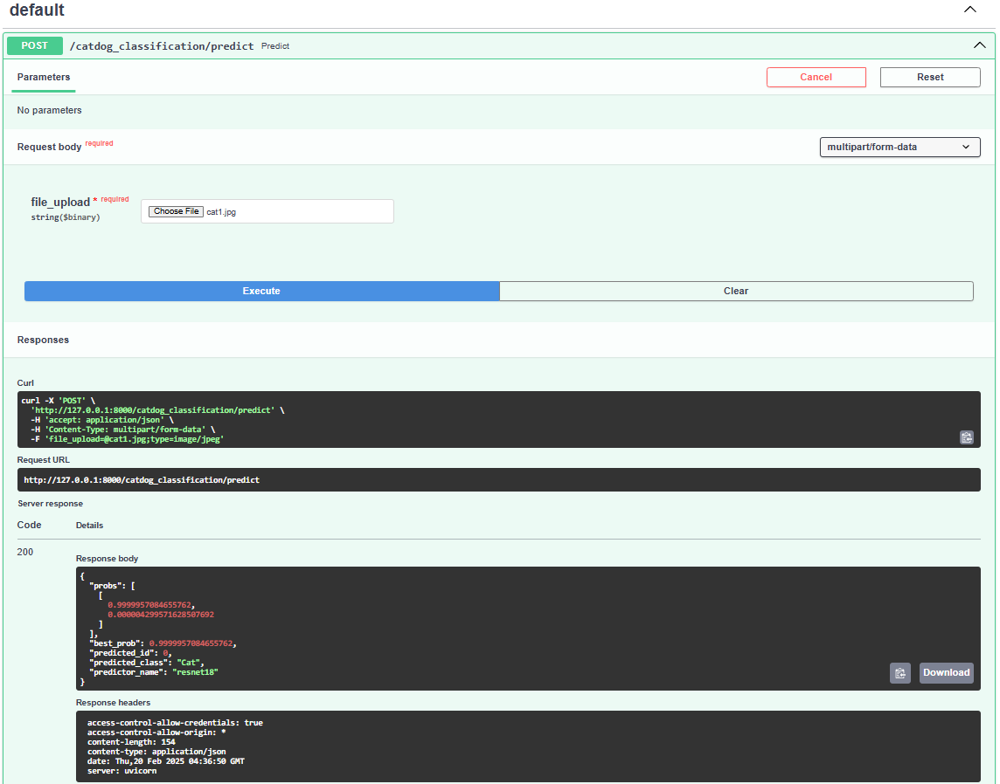

# Basic Model Deployment
## Introduction
This is a project base on a **AI VIET NAM** video on youtube: [Deploy AI model using FastAPI](https://www.youtube.com/watch?v=bdyOM1hpnAE&t=12862s&ab_channel=AIVIETNAM). 

The model in this project is designed to predict whether an image contains a cat or a dog.

A special thanks to AI VIET NAM for providing this helpful guide!

## Folder Structure
- **configs/:** Folder containing configuration for some modules.
- **logs:** Folder containing logging information when running API.
- **middleware/:** Folder containing code for middleware.
- **models/:** Folder containing Deep Learning weights. 
- **readme_imgs/:** Folder containing images using to write *readme.md*. (Optional)
- **routes/:** Folder containing API Endpoints declaration. 
- **schemas/:** Folder containing Pydantic model declaration.
- **utils/:** Folder containing codes for general purpose (varying between projects).
- **app.py:** Python file containing codes for FastAPI app initialization. 
- **notebook.ipyb:** 
- **requirements.txt:** File containing packages version information to run the source code.
- **sever.py:** Python file containing codes to host the API service.  

## Running Project
### 1. Install Dependencies
To run the code, you need to install the required packages. You can install the required packages using the following command:

```bash
conda create -n catdog python=3.10.11 --y
conda activate catdog
pip install -r requirements.txt
```
### 2. Start the FastAPI Server
To start the FastAPI application, run the following command in the terminal:

```bash
python .\server.py
```
### 3. Access the API Documentation
After starting the server, you can access the **Swagger UI** for API interaction by navigating to: http://127.0.0.1:8000/docs

### 4. Preview

